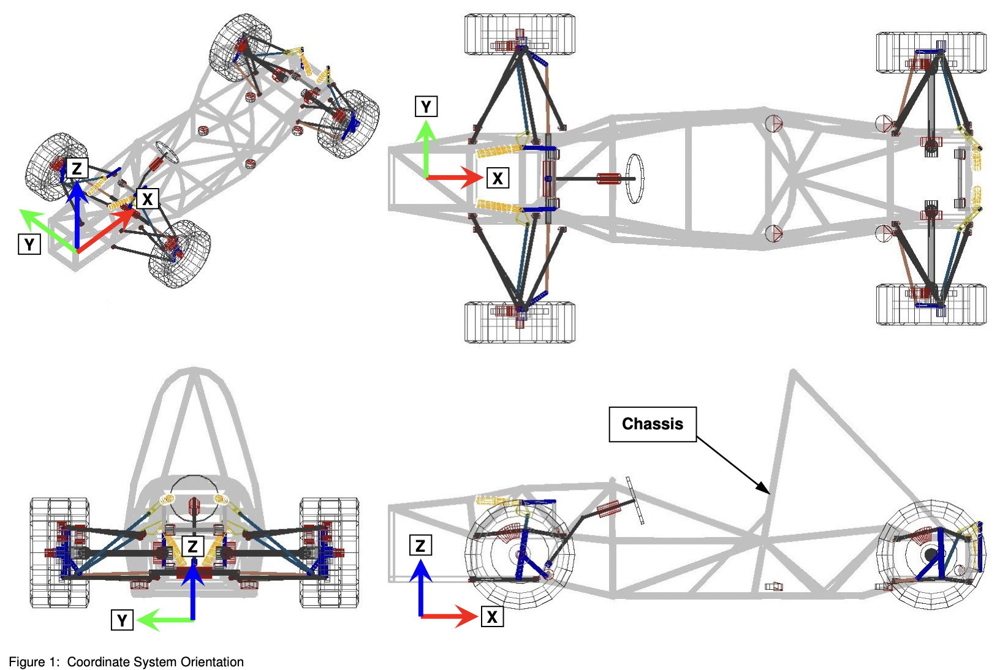

## Introduction

Vehicle chassis model developed using [Simbody](https://github.com/simbody/simbody) multi-body library. This is not a complete chassis model, it only focusses on the kinematics. The kinematic parameters are loaded from a JSON file.

**Note**: This is a work in progress to get familiar with Simbody.


## System and Subsystems Overview


System overview and reference frames (*[1] image source*)

## Open Tasks

- [ ] Implement chassis and body mass / inertia parameters and load these from JSON files
- [x] Steering mechanism kinematics
- [x] Wheel bodies
- [x] Anti-rollbar torsional stiffness
- [x] Wheel colliders and ground plane, so that the model can be dropped on the ground
- [x] Non-linear spring/damper characteristics
    - [x] Bump stops
    - [x] Damper characteristic tables
- [ ] Tire force and ground contact model
- [ ] Simple aerodynamics
- [ ] Simple driveline model
- [ ] Data logging
- [ ] Refactor

## Prerequisites

Install Simbody distribution as described on the Github page, i.e.
```shell
$ brew tap osrf/simulation
$ brew install simbody
```

Compile the `main.cpp` using your favorite compiler and link against the `Simbody` libraries.

```shell
$ clang++ -std=c++17 -Wno-deprecated -Ofast main.cpp -o main -I/opt/homebrew/Cellar/simbody/3.7/include/simbody -L/opt/homebrew/Cellar/simbody/3.7/lib -lSimTKsimbody -lSimTKmath -lSimTKcommon
```

## References

Hard points and model parameters taken from this work:

[1] Mueller, Russell Lee (2005). Full vehicle dynamics model of a formula SAE racecar using ADAMS/Car. Master's thesis, Texas A&M University. Texas A&M University. Available electronically from https://hdl.handle.net/1969.1/2600.
PDF: https://core.ac.uk/download/pdf/4269718.pdf